# Embedded Systems Coursework 2
## Introduction

The report presented here is to deliver a comprehensive analysis of the Music Synthesiser, which is implemented for Embedded System Coursework 2 by EmbedTech.

The Music Synthesiser is a real-time operating system, which is configured with all the essential functions including key detection, audio generation, volume control, octave variations, display of relevant settings and notes, as well as sending or receiving notes depending on configurations. It is also developed with several advanced features including outputting different waveforms (sinusoidal wave, square wave, triangular wave), enabling polyphony and autodetection of connected keyboards and auto-allocation of octaves.

In this report, we are also going to discuss the timing, architecture, and dependencies of the overall system, so that the application can be further studied and analysed.

## Task Identification
This section aims to briefly outline the implemented tasks of the music synthesiser.

### Scan Keys - Thread

Key sanning is one of the most fundamental functions of the music synthesiser. By pressing each individual key, its information including the note and octave stage will be transmitted to 

### Display Update - Thread
  Updates the display with the required information. Shows the user the volume level, octave, waveform choice, notes played, CAN messages, mode choice. Notes are shown in their order.

### CAN Message Receiving / Decoding task - Thread

### CAN Message Transmission - Thread

### Audio Sample Generation - Thread
  This task changes the output buffer ready for the interrupt to send it out. Depending on the chosen waveform the way in which the output buffer is loaded is altered. The sawtooth wave is simply generated by stepping through the phase accumulator with a given stepsize until it overflows and resets back to 0. The sinewave is generated using a look up table. The square wave is generated by simply having two voltage output levels, one for each half of the waveform cycle. Finally the triangle is similar to the sawtooth wave, and for the first half of the cycle it works in the same way by incrementing the phase accumulator, except in the second half of the cycle it simply decrements the accumulator.
### CAN Transmission Interrupt
### CAN Receive Interrupt
### Sample Interrupt
Double buffer.

## Task Timing Charaterisation, Critical Instant Analysis and Quantification of CPU Utilization
| Task   | Initiation Interval (ms) |Execution time (μs)| RMS priority | $(\frac{t_n}{t_i})$ | $(\frac{t_n}{t_i})*T_i$ (μs)| $(\frac{T_i}{t_i})$ (%)|
| ----------------| -------------------------|-------------------|--------------|-------|-------------------------------------------------| ----|
| Scan Keys  | 20   | 164.8125          | 4  | 5     | 824.06   | 0.824 | 
| Display Update    | 100 | 17424.03125       | 1    | 1     | 17,424.03| 17.42|
| CAN Receive and Decode    | 25.2  | 1205.90625        | 3       | 3.97  | 4,785.34  | 4.79 |
| CAN Transmit    | 60  | 905.8125          | 2     | 1.67  | 1,509.69   | 1.51|
| Audio Sample Generation     | 5  | 583               | 5   | 20    | 11,660  | 11.66|
| CAN TX Interrupt     | 5  | 583               | 5   | 20    | 11,660  | 11.66|
| CAN RX Interrupt     | 5  | 583               | 5   | 20    | 11,660  | 11.66|
| Sample Interrupt     | 5  | 583               | 5   | 20    | 11,660  | 11.66|

Total Latency = 36.2 ms
Total CPU utilization = 36.2%

## Shared Data Structures, Methods Used to Guarantee Safe Access and Synchronisation

## Inter-Task Blocking Dependencies

The dependencies of the music synthesiser system is shown as above. The diagram is aimed to use different shapes for identifying different tasks, so to clearly present the relationships. In the diagram, the ellipses represent the threads, while the rectangles and the rounded rectangles are the interrupts and queues respectively.

The dependency diagram only includes the components that need access to each other, and might cause blocking in different ways. Therefore, according to the diagram, 'msgInQ' and 'msgOutQ', which are the incoming and outcoming messages of the queues, are tightly associated with a number of components. It can be shown that the display, key scanning and audio generation functions directly depend on the hardware part, which is the keyboard. While all the interrupts are associated with the CAN hardware. It is worth mentioning that the "loop" formed with 'CAN_Transmit', 'CAN_TX_Interrupt' and 'CAN Hardware' performs as an independent task, which means that it does not influence other tasks and thus no deadlock will be caused.

The main point of this diagram is to demonstrate that there is no closed loop forming within the system, so that the risk of including deadlocks in the operation could be avoided. Thus, it is proved by this diagram that the music synthesiser system is very unlikely to be involved in any deadlock, which could cause blocking and conflicts in executing multiple tasks.

## Advanced Features

Our advanced music synthesiser is designed and implemented to introduce more features that cannot be performed by regular systems, and the features are explained as following.

### Multiple Waveforms
The music synthesizer can output audio in the form of sinusoidal, square and triangular waveform, in addition to the standard sawtooth wave. The waveform generated can be changed through turning the second leftmost knob. The current waveform chosen will be shown on the OLED display, in which 0 indicates sawtooth wave, 1 indicates sinusoidal wave, 2 indicates square wave and 3 indicates triangular wave.

### Polyphony
The music synthesizer supports polyphony, in which up to 12 keys can be played together at once. The output sound is clipped at the maximum output value.

### User-friendly Display Interface
The interface has been designed in a way to effectively show information about keyboard settings and notes being played, through deliberate choice of fonts and symbols for different waveforms, as well as clear indication of the types of settings being displayed.

