# Table of Contents

1. [Introduction](#introduction)
2. [Task Identification](#task-identification)
3. [Task timing Charachterisation](#task-timing-charaterisation-critical-instant-analysis-and-quantification-of-cpu-utilization)
4. [Data structures](#shared-data-structures-methods-used-to-guarantee-safe-access-and-synchronisation)
5. [Dependencies](#inter-task-blocking-dependencies)
6. [Advanced Features](#advanced-features)
7. [Video Instructions](#video-instructions)

# Introduction

The report presented here is to deliver a comprehensive analysis of the Music Synthesiser, which is implemented for Embedded System Coursework 2 by EmbedTech.

The Music Synthesiser is a real-time operating system, which is configured with all the essential functions including key detection, audio generation, volume control, octave variations, display of relevant settings and notes, as well as sending or receiving notes depending on configurations. It is also developed with several advanced features including outputting different waveforms (sinusoidal wave, square wave, triangular wave), enabling polyphony and carefully designed user interface.

In this report, we are also going to discuss the timing, data structure and blocking dependencies involved in the overall system, so that the application can be further studied and analysed.

## Task Identification
This section aims to briefly outline the implemented tasks of the music synthesiser.

## Scan Keys Thread

Key scanning is one of the most fundamental functions of the music synthesiser. By pressing each individual key or turning a knob, the corresponding row and column location of key matrix is set low, which enables the exact note to be detected. The readings from the key matrix are then stored in an array. The information are then decoded to the notes being pressed and octave stages being set, which are then put as a two dimensional array to output message queue to be sent by CAN message transmission task. In this task, the knob rotations are also decoded to provide different functions. In particular, knob 3 and knob 2 are used respectively for varying the volume and octave stages. Pressing knob 3 and 2 are used to set the keyboard to receiver and sender mode respectively. While rotation of knob 1 is transferred to a global variable, which is used in the audio sample generation task to select waveforms.

## Display Update Thread

Through the OLED display screen of the keyboard, this task is updating all the useful information of the keyboard execution, including the volume, octave, waveform mode, sender/receiver mode and keys being pressed/received. By using the library functions from the u8g2 driver, any information including the data that is previously stored in the array of scan keys function can be printed out and displayed on the screen. By calling different libraries, the display is extended to include customised data types, font sizes, symbols to clearly display information about the keyboard settings and notes being played.

## CAN Message Decoding Thread

This thread provides communications through CAN buses through receiving and decoding CAN messages. The CAN message, which is sent through the CAN hardware, is first received in the CAN receive interrupt, which is being mentioned in the following section, and put into an incoming message queue. The decoding thread retrieves data from the incoming message queue and decodes it to relevant step sizes for the phase accumulator in the audio sample generation thread.

## CAN Message Transmission Thread

The transmission function retrieves data from the outcoming message queue, which contains data from the key scanning task. The message is then transmitted through the CAN hardware. A mutex is taken at the end of transmission, which is being released in the CAN transmission interrupt.

## Audio Sample Generation Thread

This task changes data inside the output buffer, which is then read and output to analogue output pin by the sample interrupt to create audio. Depending on the chosen waveform, the way in which the output buffer is loaded is altered. The sawtooth wave is simply generated by stepping through the phase accumulator with a given stepsize until it overflows and resets back to 0. The sinewave is generated by applying sine function to the phase accumulator through a look up table. The square wave is generated by simply having two voltage output levels, depending on whether the phase accumulator current value is larger than a half of it. Finally, the triangle is similar to the square wave, as for the first half of the cycle of the phase accumulator the output voltage is incremented, in the second half of the cycle it decrements.
  
## CAN Transmission Interrupt

This interrupts works with CAN transmission thread by giving a semaphore whenever messages are already sent, allowing the CAN Message transmission thread to execute again.

## CAN Receive Interrupt

This interrupt is used to receive CAN messages and store them in the incoming message queue, ensuring all messages from the CAN bus are received properly. Messages received by this interrupt are processed in a different thread, alowing for the interrupt to be made very short as it receives all messages without needing to process any of them.

## Sample Interrupt
  
This is the sample interrupt that is used to output sounds from the keyboards by outputing volage values stored in the double buffer, which are loaded by the audio sample generation task. It is called using a clock at a frequency of 22kHz. Double buffering allows for more complex funtions to be used in the sample generation thread to generate audio samples and thus more complex waveforms, while the interrupt simply outputs the voltage levels to the analogue output pin.

# Task Timing Charaterisation, Critical Instant Analysis and Quantification of CPU Utilization
| Task   | Initiation Interval (ms) |Execution time (μs)| RMS priority | $(\frac{t_n}{t_i})$ | $(\frac{t_n}{t_i})*T_i$ (μs)| $(\frac{T_i}{t_i})$ (%)|
| ----------------| -------------------------|-------------------|--------------|-------|-------------------------------------------------| ----|
| Scan Keys thread                | 20   | 163.9   | 4         | 5     | 819.53       | 0.8195 | 
| Display Update thread           | 100 | 18,879.3 | 1         | 1     | 18,879.3   | 18.88|
| Decode thread                   | 25.2  | 60        | 3         | 4     | 240           | 0.24 |
| CAN Transmit thread             | 60  | 56          | 2        | 2     | 112           |0.093|
| Audio Sample Generation thread  | 5  | 975.91     | 5         | 20    | 19,518.1      | 19.52|
| CAN TX Interrupt                | 0.7  | 24       | interrupt  | 143    | 3,432        | 3.43|
| CAN RX Interrupt                | 0.7  | 24       | interrupt  | 143    | 3,432        | 3.43|
| Sample Interrupt                | 0.04545  | 9.625  | interrupt| 2201    | 21,184.625  | 21.18|
Total Latency = 67.62 ms
Total CPU utilization = 67.58%

The theoretical minimum initiaion intervals (deadlines) and measured maximum execution times for all the tasks of the system are recorded in the table above. The iniation interval of scan keys thread and display update thread is set based on the coursework requirement. The initiation interval of decode thread and CAN transmit thread is calculated based on the worst-case scenario that the scan key task is sending 12 messages per 20 ms, the CAN message transmission time is 0.7 ms, the message queues both have a length of 36. The audio sample generation thread is chosen to fill two buffers of size 110, which is set based on limiting the upper bound of latency of generating sound to 10 ms, so that the latency will not be perceptible by humans. The initiation intervals of CAN TX and RX interrupts are set to the transmission time of one CAN message. The initiation interval of sample interrupt is set to 22kHz timer period.

The execution time is measured manually based on the worst-case scenario. For scan key thread, it is sending 12 messages per iteration. For display update thread, it is displaying all possible information. For decode and CAN transmit thread, it is receiving or transmitting three messages from the queue. For audio sample generation thread, it is generating the most complex waveform, which is sinusoidal wave. For CAN TX and RX interrupt, it is sending or receiving one CAN message. For sample interrupt, it is simply time taken for one iteration.

The rate monotonic scheduler will assign priority to each task based on their initiation intervals, which are also shown in the table. Based on critical instant analysis of the system, the total latency is 67.62 ms, which is less than the initiation interval of the lowest priority task. Thus, all deadlines are met under worst case conditions.

The total CPU utilization is calculated to be 67.58%, which is less than 90% and should be considered in a safe range.

# Shared Data Structures, Methods Used to Guarantee Safe Access and Synchronisation
  There are 5 global variables being shared between different threads and interrupts
  * **currentStepSize** is an unsigned 32 bit integer array of size 12, storing the step size value corresponding to each of the 12 keys, which will then be used as counting step size for the phase accumulator. It is written in the Scan Key Task and Decode Task, and read in the Sample Task. This is protected by its own mutex.
  * **keyArray** is an unsigned 8 bit integer array of size 7, storing the readings from the key matrix, which contain the information about whether the keys and knobs have been pressed or rotated. It is written in the Scan Key Task and read in the Display Update Task. This is protected by its own mutex.
  * **RX_Message** is an unsigned 8 bit integer array of size 8, storing the CAN message received. It is written in the Decode Task and read in the Display Update Task. This is protected by its own mutex.
  * **SampleBuffer0** and **SampleBuffer1** are two unsigned 8 bit integer arrays of size 110, storing the values of voltage that should be sent to the analogue output pin to generate audio. They are written in the Sample Task and read in the sample interrupt. A double buffer is implemented by swapping the array being read and written after all elements have been read or written. These are protected by their own mutex.
  * **Knob0Rotation**, **Knob1Rotation**, **Knob2Rotation**, **Knob3Rotation** are 32 bit integer, containing values corresponding to the amount of rotation of each knob. They are all written in the Scan Key Task. Knob3 is set to control the volume with eight increments. Knob2 is set to change the octave between 0th and 8th octave. Since they are only read in the ScanKeysTask they dont need to be global variables, but they have been defined as such to show uniformity with Knob1Rotation, which does need to be a global variable since it changes the waveform, and therefore is read in the scan keys and sample tasks. The global variable implementation of all KnobRotation variables also allows for potential access from other threads or interrupts if more functions are implemented. 
  * **ifSender** is a boolean, which contain information about whether the current keyboard has been set to sender or receiver mode. It is written in the Scan Key Task and read in the Scan Key Task.

  In total there are 5 mutexes to protect the different variables. The last mutex (not previously mentioned) is used to protect the sending of CAN messages.

  Atomic accessing of variables are also used throughout the code for synchronization purposes.
  
  It should be noted that the the evey message is saved in a queue before it is transmitted and after it is received. These queues are called **msgInQ** and **msgOutQ** are used as they allow for the faster completion of the interupts and ensure that no data is lost between transmission and when it is decoded.  

# Inter-Task Blocking Dependencies

The dependencies of the music synthesiser system is shown as above. The diagram is aimed to use different shapes for identifying different tasks, so to clearly present the relationships. In the diagram, the ellipses represent the threads, while the rectangles and the rounded rectangles are the interrupts and queues respectively.

The dependency diagram only includes the components that need access to each other, and might cause blocking in different ways. Therefore, according to the diagram, `'msgInQ'` and `'msgOutQ'`, which are the incoming and outcoming messages of the queues, are tightly associated with a number of components. It can be shown that the display, key scanning and audio generation functions directly depend on the hardware part, which is the keyboard. While all the interrupts are associated with the CAN hardware. It is worth mentioning that the "loop" formed with `'CAN_Transmit'`, `'CAN_TX_Interrupt'` and `'CAN Hardware'` performs as an independent task, which means that it does not influence other tasks and thus no deadlock will be caused.

The main point of this diagram is to demonstrate that there is no closed loop forming within the system, so that the risk of including deadlocks in the operation could be avoided. Thus, it is proved by this diagram that the music synthesiser system is very unlikely to be involved in any deadlock, which could cause blocking and conflicts in executing multiple tasks.

# Advanced Features

Our advanced music synthesiser is designed and implemented to introduce more features that cannot be performed by regular systems, and the features are explained as following.

## Multiple Waveforms
The music synthesizer can output audio in the form of sinusoidal, square and triangular waveform, in addition to the standard sawtooth wave. The waveform generated can be changed through turning the second leftmost knob. The current waveform chosen will be shown on the OLED display, indicated by symbols on the display. The square wave produces a brighter more 'pixelised' sound, while the sine wave will give a clearer sound. All other features work well with all different waveforms.
## Polyphony
The music synthesizer supports polyphony, in which up to 12 keys can be played together at once. This also includes polyphony over different octaves, using multiple keyboards with CAN messages. The output sound is clipped at the maximum output value.

## User-friendly Display Interface
The interface has been designed in a way to effectively show information about keyboard settings and notes being played, through deliberate choice of fonts and symbols for different waveforms, as well as clear indication of the types of settings being displayed.

## Keyboard Autodetection (not completed)

In the current design, whenever keyboards are chained together, all of their variables (such as waveform, octave and volume) need to be set seperately set. This can be avoided if the keyboards are better aware of each other existance and are able to comunicate their position and input variables. This was attempted by modifying the format of messages to include the additional information. However, bugs were encountered that prevented the full implementation of this subtask.

# Video Instructions
https://imperiallondon-my.sharepoint.com/:v:/r/personal/pb520_ic_ac_uk/Documents/EmbedTech_CW2_Video%201.mov?csf=1&web=1&e=MLhpFV

